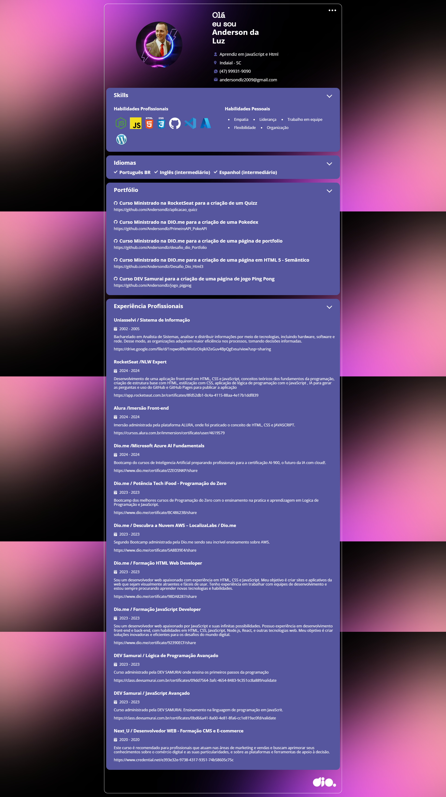

# Desafio DIO.me -  Meu Primeiro Portifolio

> Portifolio em programação

Projeto contruído na aula de JavaScript Developer administrada pela DIO e efetuando o meu primeiro Projeto utilizando os recurso de API criando no github e utilizando os conhecimento em JavaScript em API

## Tecnologias

- HTML
- CSS
- JavaScript
- GIT E GITHUB

## Contato

andersondlz2009@gmail.com